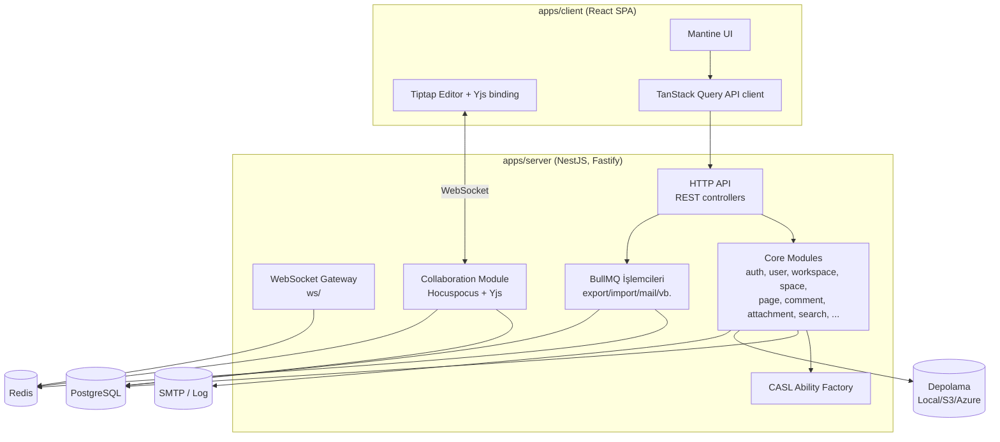
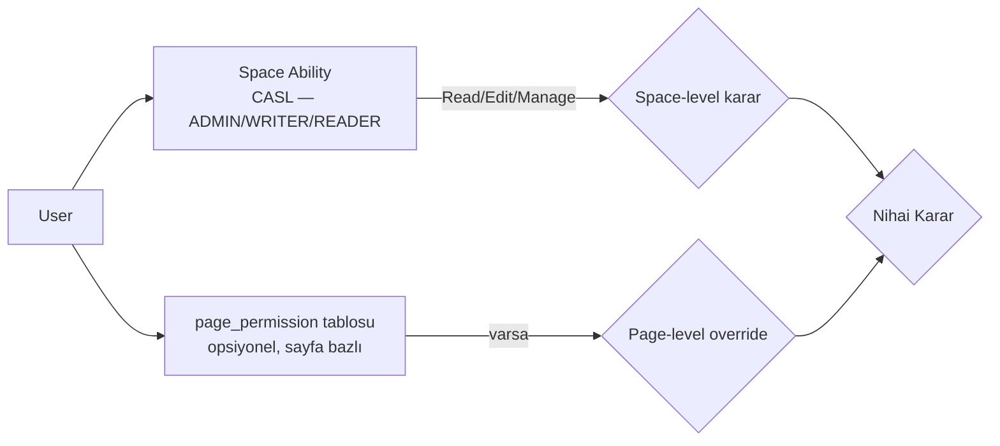
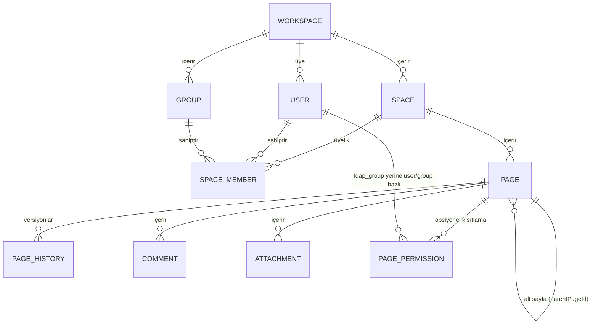
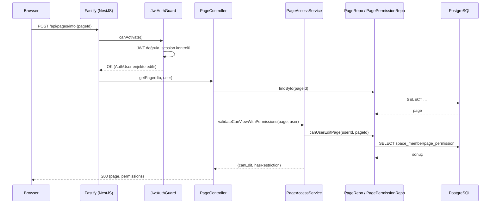
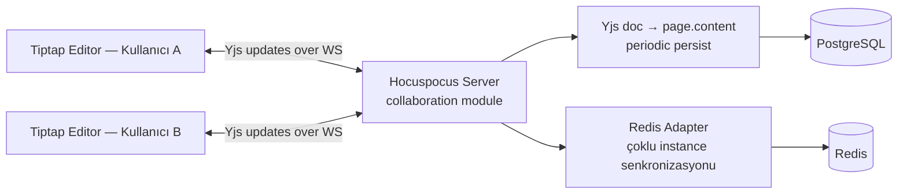
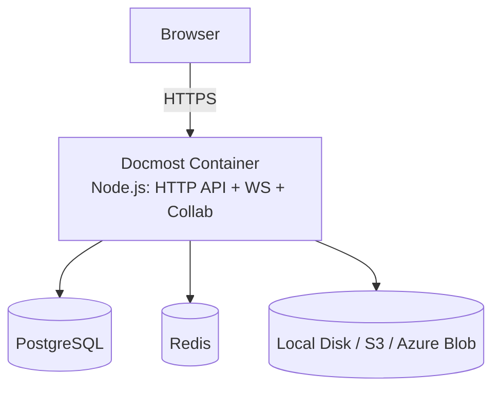

# Docmost (Open Source) — Mimari Tasarım Dokümanı

> Kapsam: Bu doküman yalnızca **Docmost OSS (AGPL-3.0)** çekirdeğinin, fork'a hiçbir değişiklik yapılmamış haliyle mevcut mimarisini anlatır. LDAP/sayfa-bazlı yetkilendirme gibi bu projede eklenen özellikler burada **yoktur** — onlar için bkz. [03-final-architecture-and-use-cases.md](./03-final-architecture-and-use-cases.md). Gereksinimler için bkz. [02-requirements-1.md](./02-requirements-1.md).

## 1. Amaç ve Kapsam

Docmost; sayfa/wiki tabanlı, gerçek zamanlı ortak düzenlemeye (collaborative editing) izin veren, self-hosted çalışabilen bir doküman/wiki uygulamasıdır. Bu doküman;

- Teknoloji yığınını,
- Sunucu tarafı modül mimarisini,
- İstemci mimarisini,
- Veri modelini,
- Gerçek zamanlı işbirliği (realtime collaboration) mimarisini,
- OSS sürümündeki yetkilendirme modelini,
- Dağıtım (deployment) modelini,

mevcut (as-is) haliyle ortaya koyar.

## 2. Teknoloji Yığını

| Katman | Teknoloji |
|---|---|
| Backend framework | NestJS 11 (Fastify adaptörü) |
| Dil | TypeScript |
| Veritabanı erişimi | Kysely (type-safe SQL query builder) |
| Veritabanı | PostgreSQL |
| Cache / Queue / Pub-Sub | Redis (ioredis, @keyv/redis, BullMQ, cache-manager) |
| Gerçek zamanlı işbirliği | Hocuspocus + Yjs (CRDT) üzerinden WebSocket |
| Yetkilendirme (uygulama içi) | CASL (ability-based) |
| Depolama | Yerel disk / S3 uyumlu / Azure Blob |
| Mail | Pluggable mail driver (log/smtp/vb.) |
| Arka plan işleri | BullMQ (Redis tabanlı kuyruk) |
| İstemci framework | React 19 + Vite |
| UI kit | Mantine |
| Zengin metin editörü | Tiptap (ProseMirror tabanlı) + Yjs collaboration extension |
| Sunucu durumu yönetimi (client) | TanStack Query |
| Yerel durum yönetimi (client) | Jotai |
| Çoklu dil (i18n) | i18next |

Monorepo; Nx ile yönetilen bir pnpm workspace'tir (`apps/server`, `apps/client`, `packages/*`).

## 3. Yüksek Seviye Bileşen Diyagramı

## 4. Sunucu Modül Haritası

`apps/server/src/core/` altında, her biri kendi NestJS modülü olan başlıca alan (domain) modülleri:

| Modül | Sorumluluk |
|---|---|
| `auth` | Email/parola ile giriş, oturum/JWT üretimi, şifre sıfırlama, ilk kurulum (setup) |
| `session` | Kullanıcı oturumlarının (user-session) saklanması/iptali |
| `user` | Kullanıcı CRUD, profil, tercihler |
| `workspace` | Çoklu-workspace (tenant) yönetimi, workspace ayarları |
| `group` | Kullanıcı grupları (manuel, Docmost içi) |
| `space` | Workspace içindeki "space" (klasör/bölüm) yönetimi ve space üyelikleri |
| `page` | Sayfa CRUD, taşıma, geçmiş (history), `page-access` alt modülü ile erişim kontrolü |
| `page/page-access` | Space-ability (CASL) + page-level restriction kombinasyonuyla view/edit kararı |
| `comment` | Sayfa yorumları |
| `attachment` | Dosya/görsel yükleme, indirme — page-access üzerinden korunur |
| `search` | Tam metin arama (Postgres tsvector), erişilebilir sayfalarla filtreleme |
| `share` | Herkese açık (public) paylaşım linkleri |
| `public-space` | Herkese açık space'ler |
| `label` | Sayfa etiketleri |
| `favorite` | Favori sayfalar |
| `notification` | Bildirimler |
| `watcher` | Sayfa takip (watch) mekanizması |
| `casl` | Space ability factory + CASL arayüzleri (bkz. §6) |

`apps/server/src/integrations/` altında altyapısal modüller: `environment` (config), `storage`, `mail`, `queue`, `audit` (OSS'ta no-op), `throttle`, `security`, `telemetry`, `health`, `export`, `import`, `static`, `encryption`, `redis`.

`apps/server/src/ee/` dizini **ticari (Enterprise Edition)** modülleri içerir (ör. SSO/OIDC, SCIM, MFA, audit log, AI, page-permission'ın gelişmiş bazı varyasyonları, billing). `app.module.ts` bu dizini `try/require` ile dinamik yükler; mevcut değilse (saf OSS build) sessizce atlanır. **Bu proje bağlamında önemli olan nokta:** upstream Docmost dokümantasyonuna göre LDAP/AD entegrasyonu ve bazı gelişmiş page-permission senaryoları ticari sürüme ayrılmıştır — bu sınır, [02-requirements-1.md](./02-requirements-1.md)'in gerekçesidir.

## 5. İstemci Mimarisi (özet)

`apps/client/src/features/` altında, sunucu modülleriyle büyük ölçüde bire-bir eşleşen özellik klasörleri (`auth`, `attachments`, `comment`, ...) ve `apps/client/src/ee/` altında ticari özelliklere ait istemci bileşenleri bulunur. API çağrıları `lib/` altındaki axios tabanlı istemci ile yapılır; sunucu durumu TanStack Query, global/yerel UI durumu Jotai ile yönetilir. Zengin metin editörü Tiptap üzerine kuruludur ve gerçek zamanlı işbirliği için Yjs doküman senkronizasyonuna (`y-prosemirror`, `@hocuspocus/provider`) bağlanır.

## 6. Yetkilendirme Modeli (OSS)

OSS sürümünde iki katmanlı bir yetkilendirme modeli vardır:

- **Space-level**: Kullanıcının bir space'teki rolü (`ADMIN`/`WRITER`/`READER`) `SpaceMemberRepo` üzerinden okunur, `SpaceAbilityFactory` bu role göre bir CASL `MongoAbility` nesnesi üretir (`Manage`/`Read`/`Edit` aksiyonları, `Page`/`Member`/`Settings`/`Share` subject'leri üzerinde).
- **Page-level**: Eğer bir sayfaya (veya ebeveynlerine) açıkça bir `page_permission` kaydı eklenmişse (restricted page), `PagePermissionRepo.canUserAccessPage` / `canUserEditPage` bu kısıtlamayı uygulayarak space-level kararı geçersiz kılabilir (daha kısıtlayıcı yönde).
- Bu iki karar `PageAccessService.validateCanView / validateCanEdit / validateCanViewWithPermissions` içinde birleştirilir ve **tüm** page/attachment/comment controller'ları bu servis üzerinden geçer — yani tek bir "yetkilendirme çekirdeği" vardır.
- Kimlik doğrulama tamamen Docmost'un kendi `users` tablosunda tutulan email+parola (bcrypt) ile yapılır; harici bir dizin (LDAP/AD) veya SSO OSS'ta **yoktur**.

## 7. Veri Modeli (özet ER diyagramı)

Not: Kysely migration tabanlı bir şema kullanılır (`apps/server/src/database/migrations`); tip güvenliği `kysely-codegen` ile üretilen `db.d.ts` dosyasından gelir.

## 8. İstek Yaşam Döngüsü (örnek: sayfa okuma)

## 9. Gerçek Zamanlı İşbirliği (Collaboration) Mimarisi

`collaboration/` modülü, kimlik doğrulamayı `auth/collab-token` üzerinden alınan kısa ömürlü bir JWT ile yapar; WebSocket bağlantısı kurulurken bu token doğrulanır ve kullanıcı/izin bilgisi bağlantıya bağlanır.

## 10. Dağıtım Modeli (OSS, varsayılan)

Varsayılan OSS dağıtımı **tek bir container** içinde hem HTTP API'yi hem de WebSocket/collaboration sunucusunu çalıştırır (`pnpm start`); Postgres ve Redis zorunlu bağımlılıklardır. Kimlik doğrulama tamamen Docmost'un kendi veritabanında tutulur; harici bir yetkilendirme/dizin servisi yoktur.

---
Sonraki doküman: bu OSS temelinin üzerine hangi gereksinimlerin eklenmesi gerektiği için → [02-requirements-1.md](./02-requirements-1.md)
