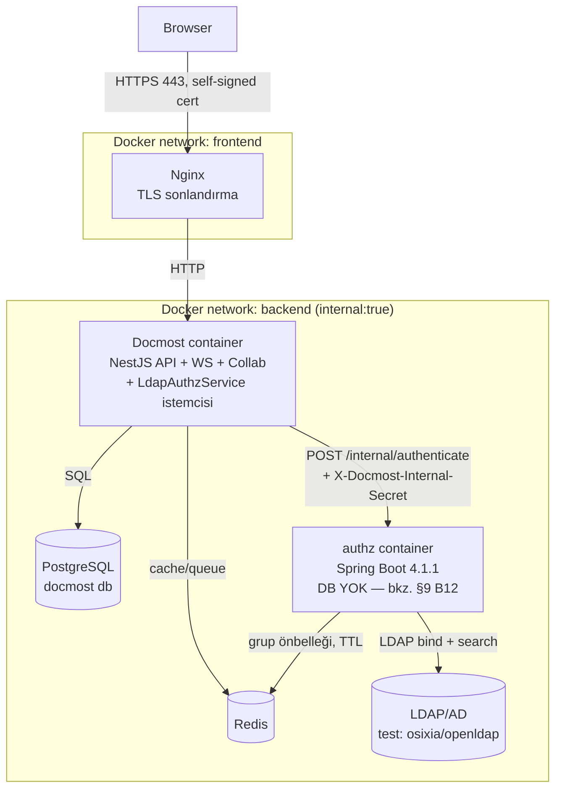
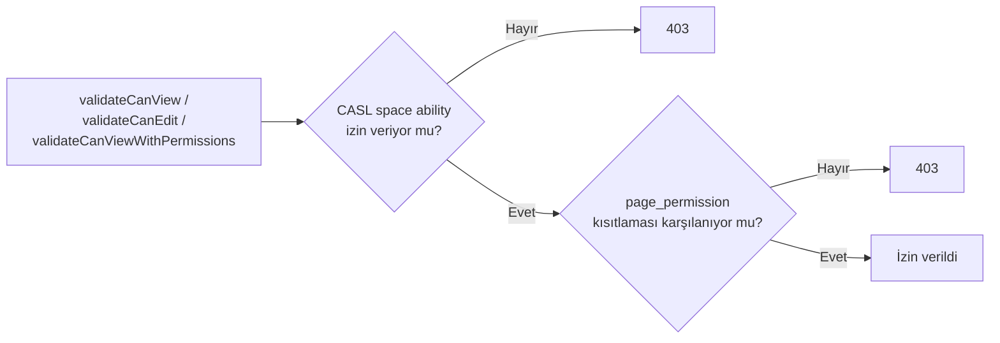
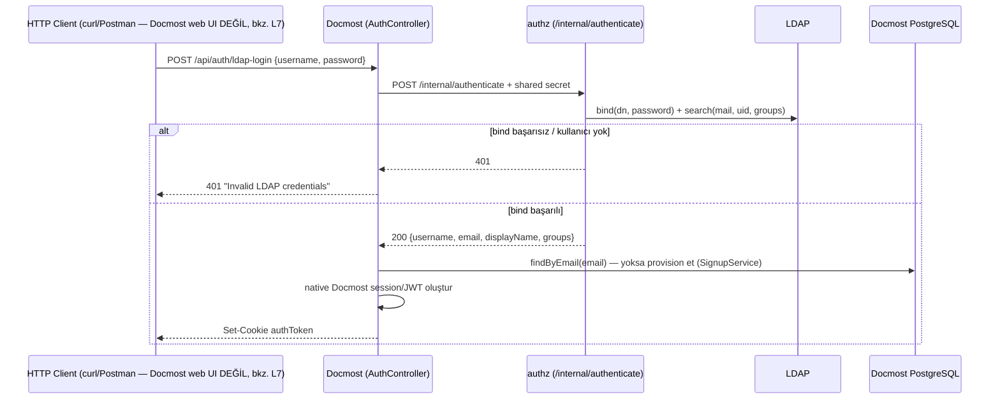
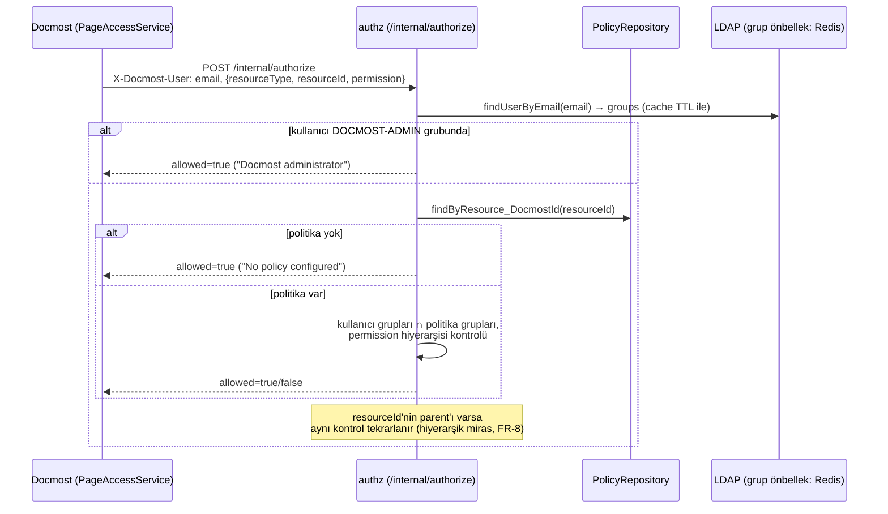
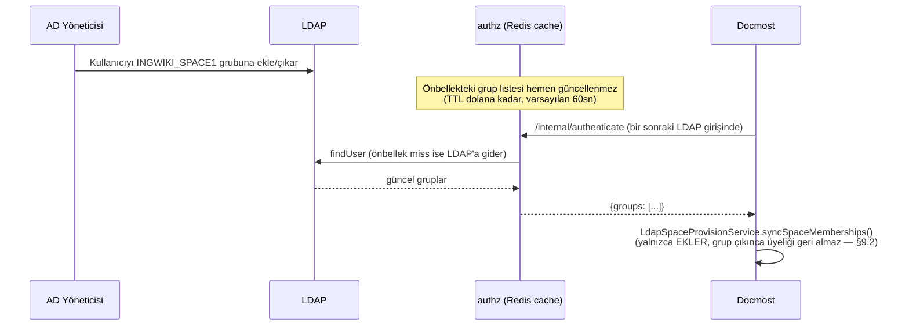
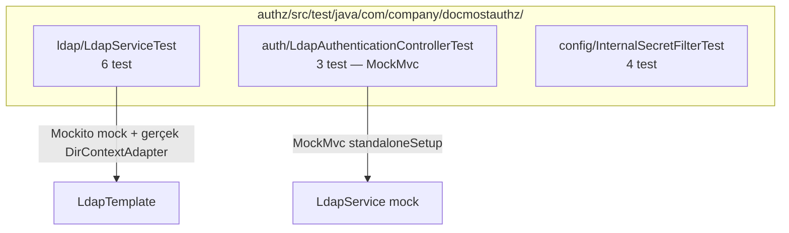
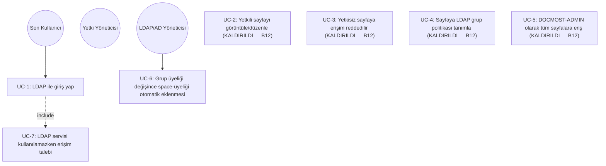

# Son Mimari ve Use Case'ler (Uygulanmış Hal)

> Bu doküman, [02-requirements-1.md](./02-requirements-1.md)'de tanımlanan gereksinimlerin **gerçekte uygulanmış, derlenmiş, `docker compose` ile ayağa kaldırılmış, canlı olarak test edilmiş ve otomatik JUnit testleriyle doğrulanmış** son halini anlatır. OSS temel mimarisi için → [01-docmost-oss-architecture.md](./01-docmost-oss-architecture.md). Burada o temel **tekrar edilmez**; yalnızca eklenen/değişen kısımlar ve bunların birbiriyle etkileşimi anlatılır.

## 1. Özet

Docmost OSS fork'u (`docmost/`) değiştirilmeden bırakılmadı; aşağıdaki iki parça eklendi:

1. **`authz/`** — bağımsız, **veritabanısız** bir **Spring Boot 4.1.1 / Java 25** servisi: yalnızca LDAP bind doğrulama + grup çözümleme (Redis önbellekli). ~~Kaynak/politika (resource/policy) veritabanı, sayfa-seviyesi yetkilendirme kararı, yönetim API'si~~ **kaldırıldı** (bkz. §9 B12) — bu servis artık yalnızca "bu kullanıcı/parola LDAP'ta geçerli mi, grupları ne?" sorusuna cevap verir, "bu kullanıcı şu sayfayı görebilir mi?" sorusuna karışmaz.
2. **Docmost sunucusunda (`docmost/apps/server`) hedefli değişiklikler**: `POST /api/auth/ldap-login` endpoint'i, `LdapAuthzService` HTTP istemcisi (yalnızca `authenticate()`), ve giriş anında LDAP grubuna göre otomatik **space** üyeliği (bkz. §9.2 B11). Sayfa/kaynak erişimi tamamen Docmost'un kendi native `SpaceRole`/`PagePermission` sistemine bırakılmıştır — LDAP grupları sayfa bazında ayrıca kontrol edilmez.

Ayrıca `docker-compose.yml`, `nginx/`, `.env.example` ve test/geliştirme amaçlı bir OpenLDAP dizini (`test/ldap/`) repo köküne eklendi. Sistem hem **canlı olarak** (gerçek Docker Compose yığını + headless browser ile) hem de **otomatik JUnit testleriyle** (§6) doğrulanmıştır.

## 2. Final Bileşen ve Dağıtım Diyagramı

Dışarıya yalnızca Nginx'in 443 portu açıktır; Postgres'ler, Redis, `authz` ve LDAP yalnızca `backend` (internal) ağındadır — bkz. requirements S3–S5.

## 3. ~~Veri Modeli — Yetkilendirme Servisi~~ (KALDIRILDI, bkz. §9 B12)

> Bu bölüm, `authz` servisinin eskiden sahip olduğu `docmost_authz` Postgres veritabanını (resource/policy şeması) anlatıyordu. Kullanıcı talebiyle bu veritabanı **ve** onu kullanan tüm sayfa-seviyesi yetkilendirme mekanizması (DOCMOST-ADMIN bypass + LDAP grup politikaları) tamamen kaldırıldı — bkz. §9 B12. `authz` servisi artık **hiçbir veritabanına bağlı değildir**; yalnızca LDAP'a bağlanır.

## 4. Docmost Tarafındaki Entegrasyon Noktası

OSS mimarisinde (`01-docmost-oss-architecture.md`, §6) tüm page/attachment/comment erişim kontrolü `PageAccessService` üzerinden geçiyordu. **B12'den önce** bu proje, LDAP kontrolünü bu mevcut tek çekirdeğin içine ek bir adım (`LdapAuthzService.isAllowed()` → authz'nin `/internal/authorize`'ı) olarak eklemişti. **B12 ile bu adım tamamen kaldırıldı** — `PageAccessService` artık LDAP'tan tamamen habersizdir:

LDAP'ın erişim kontrolüne tek katkısı artık **giriş anında** olur: kullanıcı hangi LDAP gruplarındaysa, ona karşılık gelen `INGWIKI-<AD>` space'ine otomatik üye yapılır (§9.2 B11); üyelik eklendikten sonra o kullanıcı için tamamen native `SpaceRole`/`PagePermission` sistemi geçerlidir. Sürekli/istek-bazlı bir LDAP-grup kontrolü artık **yoktur**.

## 5. Uçtan Uca Akış Diyagramları (canlı olarak doğrulanmış)

### 5.1 LDAP ile Giriş (FR-1, FR-2, FR-3, FR-4)

**Doğrulandı:** `faruk`/`ali`/`ayse` kullanıcıları seed LDAP'tan gerçek bind ile doğrulandı, ilk girişte otomatik workspace üyesi olarak oluşturuldu, `GET/POST /api/users/me` ile oturumun geçerli olduğu teyit edildi. Yanlış parola ve var olmayan kullanıcı adı için tutarlı biçimde `401` alındı (FR-4).

> ⚠️ **Önemli:** Bu akış yalnızca doğrudan API çağrısıyla (`curl`) doğrulanmıştır. Docmost web login formu bu endpoint'i çağırmaz — bkz. §8 L7.

### 5.2 Sayfa Yetkilendirme (FR-5 — FR-10)

### 5.2 ~~Sayfa Yetkilendirme~~ (KALDIRILDI, bkz. §9 B12)

> Bu bölüm, `/internal/authorize` endpoint'i ve DOCMOST-ADMIN bypass + LDAP grup politikası mekanizmasını anlatıyordu (aşağıdaki test tablosu dahil). Kullanıcı talebiyle bu mekanizma tamamen kaldırıldı; sayfa erişimi artık yalnızca Docmost'un kendi `SpaceRole`/`page_permission` sistemine tabidir (bkz. §4, §9 B12). Tarihsel kayıt olarak: o dönemde `Finance Only Page` adlı sayfaya yalnızca `DOCMOST-FINANCE` grubu için `VIEW` politikası tanımlanmış, `faruk` (DOCMOST-ADMIN bypass), `ayse` (politika eşleşmesi) izinli, `ali` (DOCMOST-HR) ve LDAP karşılığı olmayan yerel `admin` reddedilmişti.

### 5.3 ~~Yönetim API'si ile Politika Tanımlama~~ (KALDIRILDI, bkz. §9 B12)

> `/admin/resources` ve `/admin/resources/{docmostId}/policies` endpoint'leri, onları destekleyen `ResourceAdminController`/`PolicyRepository`/`ResourceRepository` ile birlikte tamamen kaldırıldı. Sayfa/space erişim yönetimi artık yalnızca Docmost'un kendi UI'ı üzerinden (space üyeliği, page permission) yapılır — ayrı bir yönetim API'sine gerek kalmadı.

### 5.4 Grup Değişikliği / Önbellek Süresi Dolumu (FR-5 G5, FR-14, NFR-1) — kapsamı B12 ile daraltıldı

**B12 sonrası önemli fark:** Bu senaryo artık yalnızca **B11'in giriş-anı space otomatik-üyelik mekanizmasını** etkiler, sürekli/istek-başına bir sayfa yetkilendirme kararını etkilemez (çünkü artık öyle bir karar yok). Yani bir kullanıcı LDAP grubundan çıkarılsa bile, zaten eklenmiş olduğu space üyeliği **geri alınmaz** (§9.2'de belgelenen bilinçli basitleştirme). Bu, kod/konfigürasyon olarak doğrulandı; uçtan uca canlı AD grup değişikliğiyle ayrıca test edilmemiştir.

## 6. Otomatik Test Paketi (JUnit)

Canlı ortam testi (§5) tek doğrulama yöntemi değildir (NFR-4); `authz` servisi için gerçek bir LDAP/Docker ortamına ihtiyaç duymayan, mock tabanlı **13 JUnit 5 testi** yazılmış ve `cd authz && mvn clean test` ile çalıştırılmıştır (B12 öncesi 30 test vardı; `AuthorizationServiceTest`(8), `AuthorizationControllerTest`(1), `ResourceAdminControllerTest`(7) ve `LdapServiceTest`'teki `findUserByEmailSearchesByMailAttribute`(1) kaldırılan kodla birlikte silindi: 30-8-1-7-1=13).

### 6.1 Test — Gereksinim İzlenebilirlik Tablosu

| Test sınıfı | Doğruladığı gereksinimler |
|---|---|
| `LdapServiceTest` | FR-1, FR-4 (bind başarı/başarısızlık, bilinmeyen kullanıcı), dizin sorgu filtrelerinin doğru kurulması |
| `LdapAuthenticationControllerTest` | FR-2, FR-4 (401 eşlemesi, kullanıcı adı sızdırmama) |
| `InternalSecretFilterTest` | FR-13, S6, S7 |

> ~~`AuthorizationServiceTest`, `AuthorizationControllerTest`, `ResourceAdminControllerTest`~~ B12 ile kaldırılan kodla birlikte silindi (FR-5…FR-13'ü kapsayan o testler artık geçerli değil, çünkü test ettikleri mekanizma mevcut değil).

### 6.2 Dikkat Çeken Test Tasarım Noktaları

- `LdapServiceTest`, gerçek bir LDAP sunucusu olmadan `LdapTemplate`'i mock'lar; ancak **gerçek** bir `DirContextAdapter(BasicAttributes, LdapName)` nesnesi üretip bunu, mock'lanan `search(...)` çağrısının `ContextMapper`/`AttributesMapper` lambda'sına `thenAnswer` ile besler — böylece üretim kodundaki mapping mantığı sahte değil gerçek obje üzerinden çalıştırılmış olur.
- `LdapAuthenticationControllerTest`, Spring context'i tamamen ayağa kaldırmadan (`@SpringBootTest` değil), `MockMvcBuilders.standaloneSetup(controller)` ile yalnızca ilgili controller'ı ve onun **controller-local** `@ExceptionHandler` metodlarını test eder — hızlı ve izole bir entegrasyon testi.

## 7. Use Case'ler

| Use Case | Aktör | Ön koşul | Akış (özet) | İlgili FR | Durum |
|---|---|---|---|---|---|
| UC-1 LDAP ile giriş | Son kullanıcı | LDAP'ta hesap var | §5.1 | FR-1..FR-4 | ✅ Canlı + birim testle doğrulandı |
| ~~UC-2 Yetkili sayfa erişimi~~ | — | — | — | — | ❌ **KALDIRILDI (B12)** — artık Docmost'un kendi `SpaceRole`/`page_permission`'ı geçerli, LDAP grubuna bağlı değil |
| ~~UC-3 Yetkisiz erişim reddi~~ | — | — | — | — | ❌ **KALDIRILDI (B12)** — aynı gerekçe |
| ~~UC-4 Politika tanımlama~~ | — | — | — | — | ❌ **KALDIRILDI (B12)** — `/admin/resources` API'si silindi |
| ~~UC-5 Admin bypass~~ | — | — | — | — | ❌ **KALDIRILDI (B12)** — DOCMOST-ADMIN bypass mekanizması silindi |
| UC-6 Grup üyeliği değişimi sonrası güncelleme | LDAP yöneticisi | Önbellek TTL dolmuş | §5.4, §9.2 | G5, FR-14 | ⚠️ Koddan doğrulandı; artık yalnızca B11'in space-otomatik-üyelik mekanizmasını etkiliyor (bkz. §5.4 B12 notu) |
| UC-7 LDAP/authz kullanılamıyor | Sistem | authz veya LDAP erişilemez | login reddedilir | FR-15 / S11 | ✅ Tasarım + birim testle doğrulandı |

## 8. Bilinen Sınırlamalar ve Sonraki Adımlar

| # | Sınırlama | Etki | Not |
|---|---|---|---|
| ~~L1~~ | ~~`search` modülü authz'a danışmıyor~~ | **KALDIRILDI (B12)** | Sayfa-seviyesi LDAP yetkilendirmesi hiç kalmadığı için bu sınırlama artık konu dışı |
| ~~L2~~ | ~~WebSocket/collaboration LDAP yetkilendirmesinden geçmiyor~~ | **KALDIRILDI (B12)** | Aynı gerekçe |
| L3 | Nested AD group resolution yok (yalnızca doğrudan `member`) | Kısıt K4'ün doğal sonucu | Gerekirse `LDAP_MATCHING_RULE_IN_CHAIN` ile genişletilebilir |
| ~~L4~~ | ~~LDAP'ta karşılığı olmayan Docmost hesapları fail-closed reddedilir~~ | **KALDIRILDI (B12)** | Artık böyle bir fail-closed sayfa reddi yok; bootstrap admin normal şekilde çalışır |
| L5 | Public sharing özelliği (FR-20) kod olarak devre dışı bırakılmadı, yalnızca öneri olarak belgelendi | FR-20 kısmen karşılanıyor | Workspace ayarlarından manuel kapatılmalı |
| **L7 (ÇÖZÜLDÜ)** | ~~`POST /api/auth/ldap-login` hiçbir frontend koduna bağlı değildi~~ — artık web login formunda (`login-form.tsx`) normal e-posta/parola formunun altında ayrı bir **"Sign in with company account (LDAP)"** formu var; `username`/`password` alıp doğrudan `/api/auth/ldap-login`'e bağlı. Docmost'un kendi EE LDAP modal'ı (`apps/client/src/ee/...`) hâlâ kullanılmıyor ve hâlâ alakasız/eksik backend'e bağlı (bkz. §8.1) — kendi ayrı formumuz onun yerine geçmiyor, sayfada **ikisi de** (SSO/EE bölümü üstte, bizim LDAP formumuz altta, "or" ayracıyla) görünüyor. | Artık tarayıcıdan gerçek bir LDAP kullanıcısıyla (ör. `faruk`) giriş yapılabiliyor; bkz. §9 B8 ve [04-headless-browser-e2e-tests.md](./04-headless-browser-e2e-tests.md) §3.6. | `apps/client/src/features/auth/{types/auth.types.ts, services/auth-service.ts, hooks/use-auth.ts, components/login-form.tsx}` değişti. |

## 8.1 Terminoloji Netliği: "Sistem LDAP ile çalışıyor" ne anlama geliyor? (artık baştan sona doğru)

L7 çözülmeden önce bu dokümandaki "doğrulandı" ifadeleri yalnızca API/backend katmanını kapsıyordu. **Artık tarayıcı üzerinden de uçtan uca doğrulanmıştır** (bkz. §9 B8): gerçek bir headless browser oturumunda `faruk` kullanıcı adı/`faruk123` parolasıyla web formundan giriş yapıldı, `/home`'a yönlendirildi, ve DOCMOST-ADMIN bypass sayesinde LDAP-kısıtlı `Finance Only Page` içeriği görüntülenebildi (ekran görüntüsüyle kanıtlandı). Satır 92'deki (§5.1) sequence diyagramındaki "Browser" katılımcısı artık gerçekten de Docmost web arayüzünü temsil edebilir (curl ile de hâlâ çağrılabilir, ikisi de geçerli).

### İlk kurulum (workspace bootstrap) hâlâ gerekli mi?

**Evet.** `/api/auth/ldap-login` (ve `/api/auth/login`) bir **workspace**'in zaten var olmasını şart koşar (`@AuthWorkspace()` decorator'ı hostname/tek-tenant üzerinden mevcut bir workspace'i çözer). Workspace'i oluşturan **tek** kod yolu hâlâ `POST /api/auth/setup`'tır (`SignupService.initialSetup()`) ve bu her zaman **parola tabanlı** bir bootstrap admin hesabı yaratır — LDAP üzerinden "workspace oluştur" diye bir akış yoktur ve bu projede eklenmedi. Yani akış şu şekilde kalıyor:

1. **Bir kez**: `POST /api/auth/setup` ile bootstrap admin + workspace oluşturulur (parola tabanlı, LDAP'tan bağımsız).
2. **Sonrasında sürekli**: LDAP kullanıcıları (`faruk`, `ali`, `ayse`, ...) web formundaki yeni LDAP alanından giriş yaptıkça, `SignupService.findOrProvisionFromLdap()` onları aynı workspace'e otomatik üye olarak ekler — ayrıca setup/davet gerekmez.

Önemli bir nüans: `findOrProvisionFromLdap()` yeni kullanıcıyı Docmost'un **native rolüyle** (`role` alanı belirtilmediği için varsayılan **`member`**) ekler. `DOCMOST-ADMIN` LDAP grubunun art​ık (B12 sonrası) sayfa/kaynak seviyesinde hiçbir özel bypass anlamı **yoktur** — bu grup adı yalnızca tarihsel bir isimdir; B11'in `INGWIKI_<AD>` → `INGWIKI-<AD>` space-eşleşme kuralı dışında LDAP gruplarının Docmost'un native workspace/space rolleriyle **hiçbir otomatik ilişkisi yoktur**. Gerekirse `findOrProvisionFromLdap()`'a belirli bir LDAP grubu için `role: 'owner'/'admin'` ataması eklenerek genişletilebilir — şu an **yapılmadı**, takip işi.

## 9. Geliştirme Sürecinde Bulunan ve Düzeltilen Sorunlar

Sistemi gerçekten `docker compose` ile ayağa kaldırıp uçtan uca test ederken (§5) ve JUnit testleri yazarken (§6) aşağıdaki gerçek hatalar bulundu ve düzeltildi. Bu liste, dokümantasyonun "kağıt üzerinde doğru görünen ama çalıştırılmadan fark edilemeyecek" sorunları nasıl ortaya çıkardığının bir kaydıdır.

| # | Sorun | Nasıl bulundu | Düzeltme |
|---|---|---|---|
| B1 | Upstream Docmost `Dockerfile`'ının `installer` aşaması `apps/client/package.json`'ı kopyalamıyordu → `pnpm install --frozen-lockfile` lockfile'ın `apps/client` girişini bulamadığı için başarısız oluyordu | `docker compose build docmost` hatası | Eksik `COPY --from=builder /app/apps/client/package.json ...` satırı eklendi |
| B2 | `LdapService.authenticate()`, boolean döndürmeyen bir `LdapTemplate.authenticate(LdapQuery, String)` overload'ını çağırıyordu | Maven derleme hatası | `ldapTemplate.authenticate(String base, String filter, String password)` overload'ına geçildi |
| B3 | `spring.ldap.base` **ve** tamamen nitelikli (fully-qualified) `LDAP_USER_SEARCH_BASE`/bind DN aynı anda tanımlıydı → LdapTemplate base'i iki kez ekleyip `No Such Object` hatası veriyordu | Canlı LDAP login denemesi 500 döndü, authz logları `NameNotFoundException` gösterdi | `spring.ldap.base` tamamen kaldırıldı; tüm DN'ler her yerde mutlak (absolute) tutuldu |
| B4 | `/internal/authorize`, `X-Docmost-User` header'ındaki **email**'i LDAP `uid` filtresiyle (`(uid={0})`) arıyordu → her yetkilendirme isteği "kullanıcı bulunamadı" ile reddediliyordu | Canlı testte admin/üye kullanıcılar sayfaya erişemedi, authz logları incelendi | `LdapService.findUserByEmail()` eklendi (`(mail=...)` filtresiyle), yalnızca `/internal/authorize` yolunda kullanılıyor; `/internal/authenticate` hâlâ `uid` ile arıyor |
| B5 | `LdapUser` (bir `record`) Redis'e önbelleğe alınırken serialize edilemiyordu; `GenericJackson2JsonRedisSerializer` denemesi de Spring Boot 4'ün Jackson 3 taban çizgisinde eksik `com.fasterxml.jackson.databind` sınıfları yüzünden **çöküş döngüsüne (crash-loop)** yol açtı | Canlı testte authz container'ı sürekli yeniden başlıyordu, `docker inspect ... RestartCount` ile fark edildi | `LdapUser implements Serializable` yapıldı, Redis cache varsayılan `JdkSerializationRedisSerializer`'a geri alındı (yalnızca anahtar serializer'ı `String` olarak özelleştirildi) |
| B6 | `AuthorizationService.authorize()`'ın ebeveyn-zinciri döngüsü, hedef kaynak için üretilen spesifik "allow" nedenini döngü sonunda genel bir mesajla eziyor; ayrıca bazı testler artık hiç çağrılmayan (deny erken döndüğü için ulaşılamayan) repository metodlarını mock'luyordu | JUnit testi yazılırken (`unmanagedResourceWithNoPoliciesIsAllowed` beklenmedik mesaj döndürdü, üç test Mockito "UnnecessaryStubbingException" ile başarısız oldu) | Test asersiyonları gerçek (ve doğru) davranışa göre düzeltildi; üretim kodu bilerek değiştirilmedi (bkz. L6 — yalnızca kozmetik) |
| B7 | `docker-compose.yml`'deki `backend` ağı `internal: true` olduğundan, bu ağa bağlı bir servisin host'a port yayınlaması (`ports:`) `HostConfig.PortBindings` dolu görünmesine rağmen gerçekte çalışmıyordu (`NetworkSettings.Ports` boş kalıyordu) | Geçici bir tarayıcı-testi amaçlı port yayınlama denemesi host'tan erişilemedi | Yalnızca geçici/yerel test amacıyla ilgili servis ek olarak `internal:false` olan `frontend` ağına da bağlandı; kalıcı `docker-compose.yml`'de `backend` hâlâ `internal: true` |
| B8 | L7'nin çözümü: frontend'e gerçek bir LDAP giriş yolu eklendi (`ILdapLogin` tipi, `ldapLogin()` servis çağrısı → `POST /api/auth/ldap-login`, `useAuth().ldapSignIn()`) | Kullanıcının "frontend LDAP'ı desteklemiyorsa sistem neyle çalışıyor?" sorusu üzerine | Docmost image'ı yeniden build edilip yeniden başlatıldı; headless browser'da gerçekten `faruk`/`faruk123` ile web formundan giriş yapıldı, `/home`'a yönlendi, ve LDAP-kısıtlı `Finance Only Page`'in içeriği (DOCMOST-ADMIN bypass ile) görüntülenebildi — ekran görüntüsüyle kanıtlandı (bkz. 04 §3.6) |
| B9 | B8'in ardından login formu **tek form + iki ayrı submit butonu** olacak şekilde yeniden düzenlendi: aynı "Email or username" alanı hem normal girişte e-posta hem de LDAP girişinde kullanıcı adı olarak paylaşılıyor; hangi butona basıldığı (`event.nativeEvent.submitter.value`) hangi akışın (`signIn` vs `ldapSignIn`) çalışacağını belirliyor; e-posta formatı doğrulaması yalnızca şifre-yolu seçildiğinde yapılıyor | Kullanıcı talebi: "bir form olsun, iki submit olsun... kullanıcı hangisinden giriş yapacağına karar versin" | `login-form.tsx` tek `<form>`'a indirgendi (iki ayrı `useForm`/`<form>` yerine), `onSubmit` el ile `form.validate()` + `submitter.value` kontrolü yapıyor. Headless browser'da üç senaryo da doğrulandı: (1) `faruk`/`faruk123` ile LDAP butonu → `/home`; (2) `faruk`/yanlış parola ile LDAP butonu → ekranda kırmızı "Invalid LDAP credentials" alert'i (hata mesajı doğru dışarı aktarılıyor); (3) `faruk` (e-posta değil) ile normal "Sign In" butonu → alanın altında inline "Enter a valid email" hatası, hiç API çağrısı yapılmadı; (4) `admin@placeholder.test`/`Password123!` ile normal "Sign In" → `/home` (regresyon yok) |
| B10 | LDAP ile provision edilen kullanıcılar artık Docmost `users` tablosunda **gerçek bir parola hash'i taşımıyor**. Daha önce `findOrProvisionFromLdap()`, hiç kullanılmayan rastgele bir `nanoIdGen(32)` parolası üretip hash'liyordu (hem gereksiz hem de "parola var" yanılgısına yol açıyordu) | Kullanıcı talebi: "user tablosunda password bu kullanıcı için tutulmasa, external vs şeklinde bir kolonda işaretlense" | Yeni migration `20261004T140000-add-auth-source-to-users` ile `users.auth_source` kolonu eklendi (`'local'` varsayılan, `'ldap'` LDAP-provisioned kullanıcılar için) ve `users.password` nullable yapıldı (zaten şemada `NOT NULL` değildi, kolon üzerinde garanti altına alındı). `findOrProvisionFromLdap()` artık `password: null, authSource: 'ldap'` ile insert ediyor; `UserRepo.insertUser()` yalnızca parola verilmişse hash'liyor. `AuthService.login()` ve `changePassword()`'a `user.password` null ise bcrypt'e hiç girmeden genel bir hata (`"Email or password does not match"` / `"Password change is not available for LDAP/SSO accounts"`) döndüren erken-çıkış eklendi — null hash ile `bcrypt.compare` çağrılıp 500 patlaması engellendi. Oturum oluşturma yolu (`sessionService.createSessionAndToken(user)`) LDAP ve yerel girişte **zaten aynıydı** (B8'den beri), bu nedenle "LDAP'tan login olunca local user gibi devam etsin" isteği ek bir değişiklik gerektirmedi. Headless browser'da doğrulandı: mevcut `faruk/ali/ayse` demo kullanıcıları `auth_source='ldap', password=NULL` olacak şekilde elle güncellendi (gerçek ortamda yeni kullanıcılar zaten bu şekilde provision edilir), sonra (1) `faruk`/`faruk123` + LDAP butonu → `/home` (regresyon yok); (2) `faruk@placeholder.test` + herhangi bir parola + "Sign In" (şifre) butonu → temiz `401` + `"Email or password does not match"`, sunucu loglarında hata/istisna yok |
| B11 | LDAP grup tabanlı otomatik **space** üyeliği eklendi: `INGWIKI_<AD>` LDAP grubundaki bir kullanıcı, her LDAP girişinde, workspace'teki `INGWIKI-<AD>` adlı space'e otomatik olarak `writer` rolüyle üye yapılıyor; bu noktadan sonra Docmost'un native `SpaceRole` (admin/writer/reader) yetkilendirmesi normal şekilde devreye giriyor | Kullanıcı talebi: "space isimleri INGWIKI ile başlasın... bu space'e girmek istediğinde kullanıcının ldap grubunda INGWIKI_SPACENAME olsa ve girse... bu girişten sonra native yetkiler geçerli olsa" | Yeni `LdapSpaceProvisionService` (`integrations/ldap-authz/ldap-space-provision.service.ts`), `AuthService.loginWithLdap()` içinden, kullanıcı provision edildikten hemen sonra çağrılıyor: `ldapUser.groups` içindeki her `INGWIKI_<AD>` deseniyle eşleşen grup için, aynı workspace'te `INGWIKI-<AD>` adında (case-insensitive) bir space aranıyor; bulunursa ve kullanıcı henüz üye değilse `SpaceMemberService.addUserToSpace(userId, spaceId, SpaceRole.WRITER, workspaceId)` ile eklenerek **idempotent ve yalnızca ekleyici** (LDAP grubundan çıkarılsa bile mevcut üyeliği geri almaz) bir senkronizasyon yapılıyor. Tek bırakma hatası: `SpaceMemberRepo.getUserSpaceRoles()` üye yoksa `[]` değil `undefined` döndürüyor; ilk implementasyon bunu kontrol etmeyince `existingRoles.length` çağrısı `500 Internal Server Error`'a yol açtı (`TypeError: Cannot read properties of undefined`), `existingRoles?.length` ile düzeltildi. Headless browser + doğrudan SQL ile doğrulandı: test LDAP dizinine `INGWIKI_SPACE1` grubu (üye: `ali`) eklendi, workspace'e `INGWIKI-SPACE1`/`INGWIKI-SPACE2` space'leri oluşturuldu; `ali`'nin LDAP girişiyle **yalnızca** `INGWIKI-SPACE1`'e `writer` rolüyle otomatik eklendiği (`INGWIKI-SPACE2`'ye **eklenmediği**) doğrulandı; `/spaces` listesinde yalnızca `General` + `INGWIKI-SPACE1` göründü; space içinde "New page"/"Create page"/"Space settings" butonlarının görünmesiyle native `writer` yetkisinin geçerli olduğu kanıtlandı; `INGWIKI-SPACE2`'ye doğrudan URL ile gidildiğinde temiz bir `404` alındı |
| B12 | **DOCMOST-ADMIN bypass + LDAP grup politikası (resource/policy) mekanizması tamamen kaldırıldı**, bununla birlikte `authz` servisinin **veritabanı gereksinimi de ortadan kalktı**: `/internal/authorize` ve `/admin/resources/**` endpoint'leri, `Resource`/`Policy` JPA entity'leri + repository'leri, `AuthorizationService`/`AuthorizationController`/`ResourceAdminController`, `docmost_authz` Postgres DB'si (`authz-postgres` servisi + `schema.sql`), `LdapProperties.adminGroup`, `LdapService.findUserByEmail()` (yalnızca authorize tarafından kullanılıyordu) — hepsi silindi. Docmost tarafında `PageAccessService.assertLdapAllowed()` ve `LdapAuthzService.isAllowed()` kaldırıldı; `LdapPermission`/`LdapResourceType` enum'ları silindi | Kullanıcı talebi: "DOCMOST-ADMIN yapısında kurulu olan ldap grup mekanizmasını... kaldır. dolayısıyla authz modülünün db gereksinimi kalmasın" | authz: `pom.xml`'den `spring-boot-starter-data-jpa` + `postgresql` kaldırıldı; `application.yml`'den `spring.datasource`/`spring.jpa` blokları + `docmost.ldap.admin-group` silindi. `docker-compose.yml`'den `authz-postgres` servisi (image, env, volume, healthcheck), `authz`'ın ona olan `depends_on`'u, `AUTHZ_DB_PASSWORD`/`LDAP_ADMIN_GROUP` env değişkenleri ve `authz-postgres` named volume'u kaldırıldı (`.env`/`.env.example`'dan da aynı iki değişken silindi). **Not:** `/internal/authenticate` (login) ve LDAP grup bilgisinin space-otomatik-üyelik için kullanılması (B11, §9.2) bu değişiklikten **etkilenmedi** — B11 zaten authz'nin DB'siyle değil, doğrudan `authenticate()` yanıtındaki `groups` alanıyla çalışıyordu. Doğrulama: `mvn clean test` → 13/13 geçti (eski 30'dan, silinen testler hariç); `docker compose build authz`/`docker compose build docmost` ikisi de başarılı; canlı ortamda `authz` container'ı **hiç datasource/JPA log satırı olmadan** başladı; `ali`/`ali123` ile taze bir LDAP girişi hâlâ `/home`'a yönlendirdi (B11 etkilenmemiş); `docker compose logs docmost\|authz \| grep -i error` boş döndü; orphan `authz-postgres` container'ı ve `authz-postgres` volume'u temizlendi |

## 9.1 `users.auth_source` ve parolasız LDAP kullanıcıları (B10 detayı)

- **Şema**: `users.auth_source varchar NOT NULL DEFAULT 'local'`, `users.password varchar NULL`.
- **Provisioning**: `SignupService.findOrProvisionFromLdap()` yeni kullanıcıyı `password: null, authSource: 'ldap'` ile oluşturur; normal `signup()`/`initialSetup()` yolları `authSource` alanını hiç belirtmez, DB varsayılanı (`'local'`) devreye girer.
- **Login tarafı korumaları**: `AuthService.login()` parola karşılaştırmasından **önce** `user.password` boşsa genel `"Email or password does not match"` hatasıyla reddeder (kullanıcı numaralandırmayı önlemek için LDAP kullanıcısı olup olmadığını ayrıca belirtmez). `AuthService.changePassword()` aynı şekilde `user.password` boşsa `"Password change is not available for LDAP/SSO accounts"` ile reddeder. `forgotPassword`/`passwordReset` akışları bilinçli olarak **değiştirilmedi** — bir LDAP kullanıcısı teorik olarak parola sıfırlama akışından bir Docmost yerel parolası edinebilir; bu, talep edilmemiş bir kapsam genişlemesi olduğundan şimdilik takip işi olarak bırakıldı.
- **Oturum tutarlılığı**: `loginWithLdap()` ve `login()` ikisi de aynı `sessionService.createSessionAndToken(user)` çağrısına çıkar — LDAP girişi sonrası oturum, cookie, ve sonraki tüm istekler yerel girişle **birebir aynı** şekilde işler; ayrı bir "LDAP oturumu" kavramı yoktur.

## 9.2 LDAP grubuna göre otomatik space üyeliği (B11 detayı)

- **Kural**: `INGWIKI_<AD>` adlı bir LDAP grubunun üyesi olan bir kullanıcı, LDAP ile her giriş yaptığında, aynı workspace içinde `INGWIKI-<AD>` adlı (alt çizgi → tire, case-insensitive) bir space varsa, oraya otomatik olarak `SpaceRole.WRITER` rolüyle eklenir. Örnek: LDAP grubu `INGWIKI_SPACE1` → space `INGWIKI-SPACE1`.
- **Idempotent ve yalnızca ekleyici**: Her girişte çalışır ama zaten üye olan kullanıcıyı tekrar eklemez (önce `SpaceMemberRepo.getUserSpaceRoles()` ile kontrol edilir); LDAP grubundan çıkarılma durumunda mevcut üyeliği **geri almaz** (kapsam dışı, bilinçli olarak basit tutuldu).
- **Bundan sonra native yetki geçerli**: Üyelik eklendikten sonra, o space içindeki tüm işlemler (sayfa oluşturma/düzenleme, space ayarları, vb.) tamamen Docmost'un kendi `SpaceRole` (`admin`/`writer`/`reader`) yetkilendirme sistemi tarafından yönetilir — ayrı bir özel yetki kontrolü yoktur. (B12 öncesinde ayrıca bir sayfa-seviyesi `authz` bypass mekanizması da vardı — DOCMOST-ADMIN grubu — ama bu tamamen kaldırıldı, bkz. §9 B12; artık LDAP gruplarının Docmost yetkilendirmesine tek katkısı bu space-otomatik-üyelik kuralıdır.)
- **Uygulama noktası**: `AuthService.loginWithLdap()`, `findOrProvisionFromLdap()`'tan hemen sonra `LdapSpaceProvisionService.syncSpaceMemberships(user.id, workspaceId, ldapUser.groups)` çağrır. Bu servis `core/space` modülünün `SpaceMemberService.addUserToSpace()`'ini kullanır; başarısız olursa (ör. DB hatası) hatayı loglar ama login akışını **bloklamaz**.
- **Bilinen sınırlama**: Yalnızca `normal` (private/public fark etmeksizin) space'ler desteklenir; grup adındaki `<AD>` kısmı ile space adındaki `<AD>` kısmı birebir (case-insensitive) eşleşmelidir.

## 10. Orijinal Taslaktan (`docmost-ldap-page-authorization.md`) Bilinçli Sapmalar

Kaynak taslak doküman bazı noktalarda daha ayrıntılı veya farklı bir tasarım öneriyordu; uygulama sırasında aşağıdaki bilinçli basitleştirmeler yapıldı:

| Taslaktaki öneri | Gerçekte yapılan | Gerekçe |
|---|---|---|
| `security/JwtService.java` + authz servisinin kendi JWT'sini üretmesi (taslak §11) | authz servisi hiçbir oturum/JWT üretmiyor; yalnızca `{username, email, displayName, groups}` döner, Docmost kendi native session'ını kuruyor | Taslağın kendisi de §17'de "Spring Boot'un session cookie'sini Docmost'a kullandırmıyoruz" diyerek bunu zaten öngörüyordu; ayrı bir JWT katmanı gereksiz karmaşıklık olurdu |
| `SecurityConfig`'te `LdapAuthenticationProvider` + `BindAuthenticator` (Spring Security'nin kendi LDAP auth mekanizması, taslak §10) | Doğrudan `LdapTemplate.authenticate(dn, filter, password)` + elle yazılmış `LdapService.authenticate()` | authz servisi kullanıcıya hiçbir zaman kendi oturumunu açmıyor (yalnızca stateless bir API); Spring Security'nin tam authentication provider zincirine gerek kalmadan daha az bağımlılıkla aynı sonuç elde edildi |
| Tek bir `config/LdapConfig.java` dosyası | `LdapProperties` (ayarlar) + Spring Boot'un `spring-boot-starter-data-ldap` auto-configuration'ı ile `LdapTemplate`/`BaseLdapPathContextSource` bean'leri otomatik üretildi | Spring Boot 4 auto-configuration zaten yeterli; elle bean tanımlamak gereksiz tekrar olurdu |
| `AuthorizationRequest`'te `username` alanı (taslak §4) | `AuthorizationRequest` yalnızca `{resourceType, resourceId, permission}` taşıyor; kullanıcı kimliği ayrı bir `X-Docmost-User` header'ından okunuyor (taslağın kendi §15'i ile tutarlı) | Taslağın §4 ve §15 bölümleri arasındaki küçük bir tutarsızlık, §15'teki (daha güvenli: kimlik body'de değil header'da) yaklaşım esas alınarak çözüldü |

## 11. Operasyonel Notlar

- Repo yerleşimi: `/home/onder/dev/docmost/` Docmost OSS fork'unun kendi git deposudur (`git rev-parse --show-toplevel` bu dizini verir); bu depo içindeki Docmost kaynak kodu haricindeki her şey (`authz/`, `nginx/`, `certs/`, `test/`, `spec/`, `docker-compose.yml`, `.env*`) aynı repo içinde **`ingwiki/` alt klasörüne** taşınmıştır, böylece tüm ek geliştirmeler de aynı git geçmişi üzerinden takip edilebilir. `docker-compose.yml`'in `docmost` servisi `context: ..` ile (yani repo kök dizinini) build eder.
- Tüm servisler `ingwiki/docker-compose.yml` ile ayağa kalkar: `cd ingwiki && docker compose up -d`; `.env.example` → `.env` kopyalanıp secret'lar `openssl rand -hex 32` ile üretilmelidir (`.env` ve `certs/*.pem`, kök `.gitignore` ile commit edilmekten korunur).
- Geliştirme/test ortamı için gerçek AD yerine `ingwiki/test/ldap/` altında `osixia/openldap` + seed LDIF kullanılır (`dc=placeholder,dc=test`, kullanıcılar `faruk/ali/ayse`, gruplar `DOCMOST-ADMIN/IT/ARCHITECT/HR/FINANCE/INGWIKI_SPACE1` — `DOCMOST-ADMIN` artık yalnızca tarihsel bir isim, B12 sonrası özel bir anlamı yok).
- Dışarıya yalnızca Nginx'in 443'ü (self-signed sertifika, `ingwiki` hostname'i) açılır; üretimde gerçek bir sertifika ile değiştirilmelidir.
- `authz` servisi **veritabanı kullanmaz** (B12); `/internal/**` endpoint'leri (yalnızca `/internal/authenticate` kaldı, `/admin/**` tamamen silindi) yalnızca `X-Docmost-Internal-Secret` header'ı ile erişilebilir (S6, S7).
- `authz` servisinin birim testlerini çalıştırmak için: `cd ingwiki/authz && mvn clean test` (gerçek LDAP/Docker/DB gerekmez; `clean` şart — Java kaynak dosyaları silindiğinde `target/`'daki eski derlenmiş testler `mvn test` ile hâlâ çalışmaya çalışıp yanlış hatalar verir; bkz. §6).
- §5'teki canlı doğrulamanın tekrarlanabilir, adım adım script'i ve en güncel çalıştırma sonuçları için → [04-headless-browser-e2e-tests.md](./04-headless-browser-e2e-tests.md).

---
Bu doküman serisinin tamamı: [01-docmost-oss-architecture.md](./01-docmost-oss-architecture.md) → [02-requirements-1.md](./02-requirements-1.md) → 03 (bu doküman).
