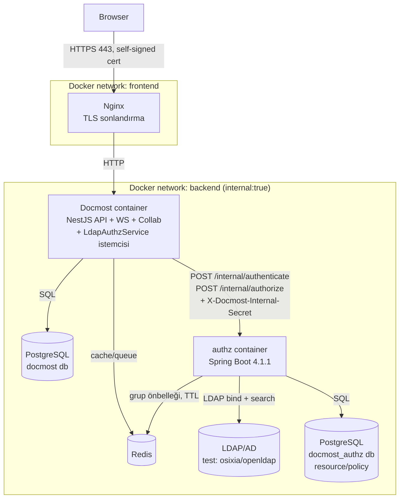
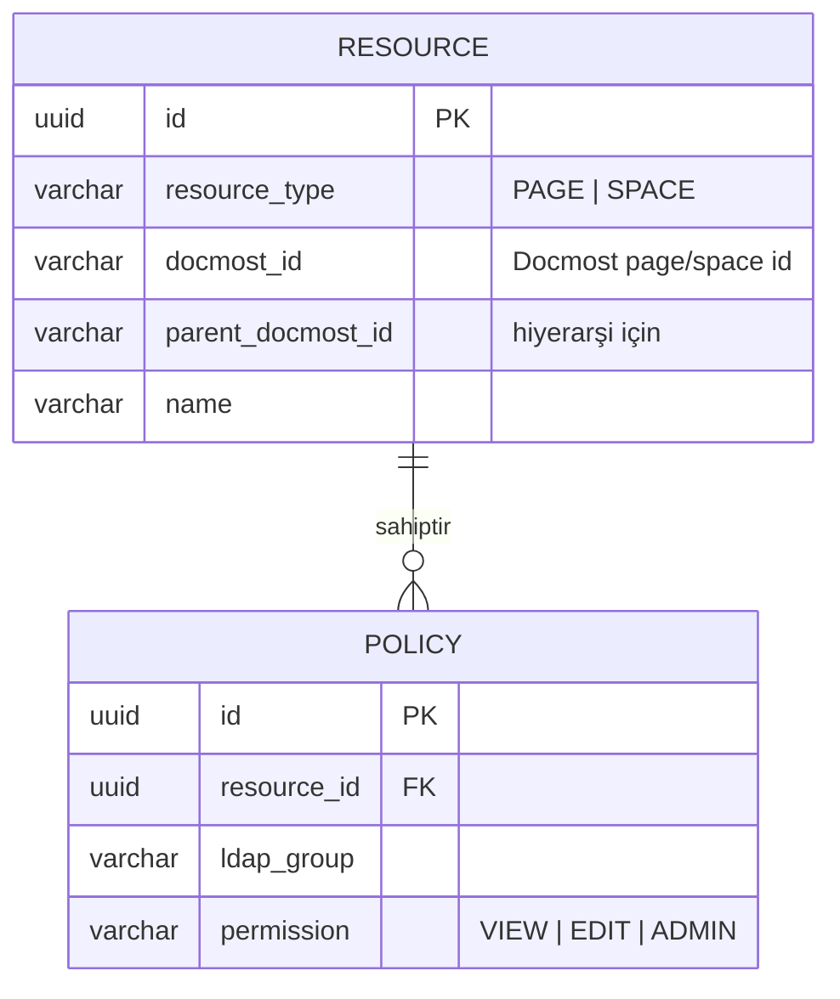
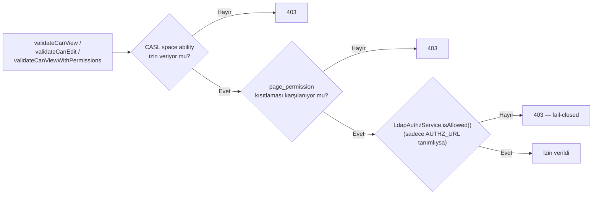
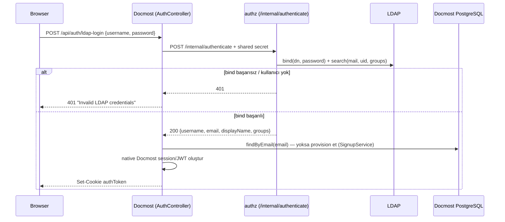
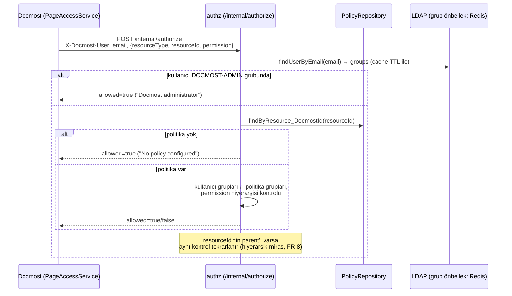
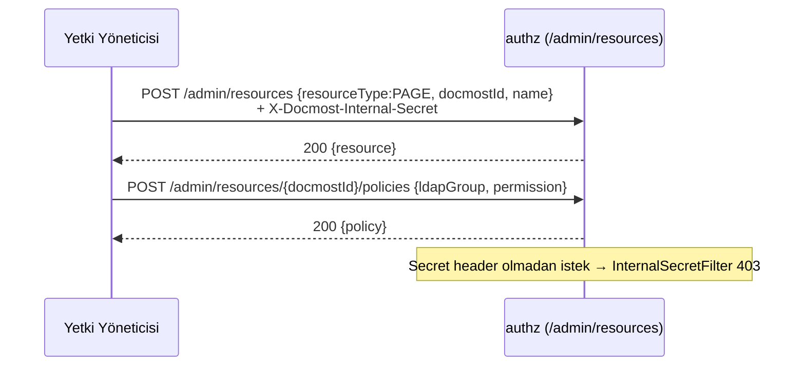
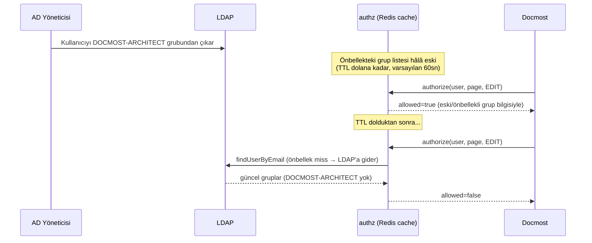
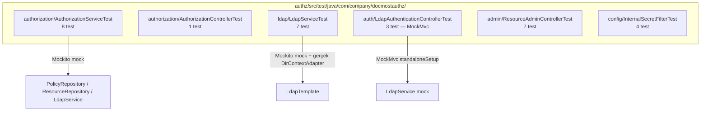
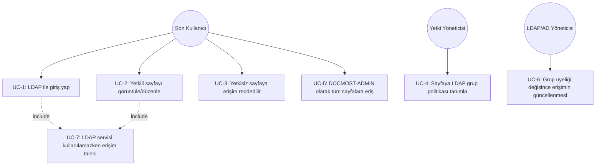

# Son Mimari ve Use Case'ler (Uygulanmış Hal)

> Bu doküman, [02-requirements-1.md](./02-requirements-1.md)'de tanımlanan gereksinimlerin **gerçekte uygulanmış, derlenmiş, `docker compose` ile ayağa kaldırılmış, canlı olarak test edilmiş ve otomatik JUnit testleriyle doğrulanmış** son halini anlatır. OSS temel mimarisi için → [01-docmost-oss-architecture.md](./01-docmost-oss-architecture.md). Burada o temel **tekrar edilmez**; yalnızca eklenen/değişen kısımlar ve bunların birbiriyle etkileşimi anlatılır.

## 1. Özet

Docmost OSS fork'u (`docmost/`) değiştirilmeden bırakılmadı; aşağıdaki iki parça eklendi:

1. **`authz/`** — bağımsız bir **Spring Boot 4.1.1 / Java 25** servisi: LDAP bind doğrulama, grup çözümleme (Redis önbellekli), kaynak/politika (resource/policy) veritabanı, yetkilendirme kararı, yönetim API'si.
2. **Docmost sunucusunda (`docmost/apps/server`) hedefli değişiklikler**: `POST /api/auth/ldap-login` endpoint'i, `LdapAuthzService` HTTP istemcisi, ve mevcut tek yetkilendirme çekirdeği olan `PageAccessService` içine LDAP kontrolünün eklenmesi (bkz. §4).

Ayrıca `docker-compose.yml`, `nginx/`, `.env.example` ve test/geliştirme amaçlı bir OpenLDAP dizini (`test/ldap/`) repo köküne eklendi. Sistem hem **canlı olarak** (gerçek Docker Compose yığını + headless browser ile) hem de **otomatik JUnit testleriyle** (§6) doğrulanmıştır.

## 2. Final Bileşen ve Dağıtım Diyagramı

Dışarıya yalnızca Nginx'in 443 portu açıktır; Postgres'ler, Redis, `authz` ve LDAP yalnızca `backend` (internal) ağındadır — bkz. requirements S3–S5.

## 3. Veri Modeli — Yetkilendirme Servisi (`docmost_authz` DB)

Bu şema, `docmost` ana veritabanından **tamamen ayrıdır** — authz servisi Docmost'un kendi şemasına hiç dokunmaz, yalnızca `docmostId` üzerinden referans tutar.

## 4. Docmost Tarafındaki Entegrasyon Noktası

OSS mimarisinde (`01-docmost-oss-architecture.md`, §6) tüm page/attachment/comment erişim kontrolü `PageAccessService` üzerinden geçiyordu. Bu proje, LDAP kontrolünü **yeni bir paralel sistem olarak değil**, bu mevcut tek çekirdeğin içine ek bir adım olarak ekledi:

Yani nihai karar **AND** mantığıyla çalışır: Docmost'un kendi space/page izni **ve** LDAP politikası aynı anda izin vermelidir (FR-6 ile uyumlu — LDAP katmanı var olan izni genişletmez, yalnızca daraltabilir).

`LdapAuthzService` (`integrations/ldap-authz/`) her çağrıda hata/timeout durumunda `false` döner (fail-closed, FR-15/S11).

## 5. Uçtan Uca Akış Diyagramları (canlı olarak doğrulanmış)

### 5.1 LDAP ile Giriş (FR-1, FR-2, FR-3, FR-4)

**Doğrulandı:** `faruk`/`ali`/`ayse` kullanıcıları seed LDAP'tan gerçek bind ile doğrulandı, ilk girişte otomatik workspace üyesi olarak oluşturuldu, `GET/POST /api/users/me` ile oturumun geçerli olduğu teyit edildi. Yanlış parola ve var olmayan kullanıcı adı için tutarlı biçimde `401` alındı (FR-4).

### 5.2 Sayfa Yetkilendirme (FR-5 — FR-10)

**Doğrulandı (gerçek test sonuçları):** `Finance Only Page` adlı sayfaya yalnızca `DOCMOST-FINANCE` grubu için `VIEW` politikası tanımlandı:

| Kullanıcı | LDAP Grupları | Beklenen | Gerçekleşen |
|---|---|---|---|
| `faruk` | `DOCMOST-ADMIN`, `DOCMOST-IT`, `DOCMOST-ARCHITECT` | İzinli (admin bypass) | ✅ 200 |
| `ali` | `DOCMOST-HR` | Reddedilir | ✅ 403 |
| `ayse` | `DOCMOST-FINANCE` | İzinli (politika eşleşmesi) | ✅ 200 |
| local `admin` (LDAP'ta yok) | — | Reddedilir (fail-closed) | ✅ 403 |

Son satır, requirements §9 kapsamında açıkça test edilmemiş ama fail-closed ilkesinin (S11) doğal bir sonucu olan önemli bir **operasyonel uyarıyı** ortaya çıkardı: bkz. §8.

### 5.3 Yönetim API'si ile Politika Tanımlama (FR-11, FR-12, FR-13)

**Doğrulandı:** Secret olmadan `/admin/**` ve `/internal/**` çağrıları reddedilir; doğru secret ile kaynak + politika başarıyla oluşturuldu (bkz. §5.2 test tablosu, bu politika kullanılarak üretildi).

### 5.4 Grup Değişikliği / Önbellek Süresi Dolumu (FR-5 G5, FR-14, NFR-1)

Bu senaryo kod/konfigürasyon olarak uygulanmıştır (`@Cacheable(..., key=...)`, TTL `LDAP_GROUPS_CACHE_TTL_SECONDS`); uçtan uca canlı AD grup değişikliğiyle ayrıca test edilmemiştir (test ortamında statik LDIF kullanıldı) — ancak §6'daki birim testleri, önbellek anahtarlama mantığının kendisini (farklı sorgu türleri için ayrı `@Cacheable` anahtarları) dolaylı olarak doğrular.

## 6. Otomatik Test Paketi (JUnit)

Canlı ortam testi (§5) tek doğrulama yöntemi değildir (NFR-4); `authz` servisi için gerçek bir LDAP/Docker ortamına ihtiyaç duymayan, mock tabanlı **30 JUnit 5 testi** yazılmış ve `cd authz && mvn test` ile çalıştırılmıştır.

### 6.1 Test — Gereksinim İzlenebilirlik Tablosu

| Test sınıfı | Doğruladığı gereksinimler |
|---|---|
| `AuthorizationServiceTest` | FR-5, FR-6, FR-7, FR-8, FR-9, FR-10, FR-15 |
| `AuthorizationControllerTest` | FR-5 (HTTP katmanı delegasyonu) |
| `LdapServiceTest` | FR-1, FR-4 (bind başarı/başarısızlık, bilinmeyen kullanıcı), dizin sorgu filtrelerinin doğru kurulması |
| `LdapAuthenticationControllerTest` | FR-2, FR-4 (401 eşlemesi, kullanıcı adı sızdırmama) |
| `ResourceAdminControllerTest` | FR-11, FR-12 |
| `InternalSecretFilterTest` | FR-13, S6, S7 |

### 6.2 Dikkat Çeken Test Tasarım Noktaları

- `LdapServiceTest`, gerçek bir LDAP sunucusu olmadan `LdapTemplate`'i mock'lar; ancak **gerçek** bir `DirContextAdapter(BasicAttributes, LdapName)` nesnesi üretip bunu, mock'lanan `search(...)` çağrısının `ContextMapper`/`AttributesMapper` lambda'sına `thenAnswer` ile besler — böylece üretim kodundaki mapping mantığı sahte değil gerçek obje üzerinden çalıştırılmış olur.
- `AuthorizationServiceTest`, `authorize()`'ın ebeveyn kaynağa **yalnızca** çocuk kaynak izin verdiğinde baktığını (deny erken döner, ebeveyne hiç bakmaz) doğrular; Mockito'nun sıkı-stub modu (strict stubbing) bu kısa-devre davranışını yanlış kurulmuş testlerde otomatik olarak yakalamıştır (bkz. §9, madde B6).
- `LdapAuthenticationControllerTest`, Spring context'i tamamen ayağa kaldırmadan (`@SpringBootTest` değil), `MockMvcBuilders.standaloneSetup(controller)` ile yalnızca ilgili controller'ı ve onun **controller-local** `@ExceptionHandler` metodlarını test eder — hızlı ve izole bir entegrasyon testi.

## 7. Use Case'ler

| Use Case | Aktör | Ön koşul | Akış (özet) | İlgili FR | Durum |
|---|---|---|---|---|---|
| UC-1 LDAP ile giriş | Son kullanıcı | LDAP'ta hesap var | §5.1 | FR-1..FR-4 | ✅ Canlı + birim testle doğrulandı |
| UC-2 Yetkili sayfa erişimi | Son kullanıcı | Oturum açık, grup politika ile eşleşiyor | §5.2 | FR-5, FR-7, FR-10 | ✅ Canlı test edildi (ayse) |
| UC-3 Yetkisiz erişim reddi | Son kullanıcı | Oturum açık, grup politika ile eşleşmiyor | §5.2 | FR-7 | ✅ Canlı test edildi (ali) |
| UC-4 Politika tanımlama | Yetki yöneticisi | Internal secret biliniyor | §5.3 | FR-11, FR-12, FR-13 | ✅ Canlı + birim testle doğrulandı |
| UC-5 Admin bypass | Son kullanıcı (`DOCMOST-ADMIN`) | — | §5.2 | FR-9, FR-10 | ✅ Canlı + birim testle doğrulandı (faruk) |
| UC-6 Grup değişikliği sonrası güncelleme | LDAP yöneticisi | Önbellek TTL dolmuş | §5.4 | G5, FR-14 | ⚠️ Koddan doğrulandı, canlı AD senaryosu test edilmedi |
| UC-7 LDAP/authz kullanılamıyor | Sistem | authz veya LDAP erişilemez | fail-closed deny | FR-15 / S11 | ✅ Tasarım + birim testle doğrulandı (`unresolvableLdapIdentityFailsClosed`) |

## 8. Bilinen Sınırlamalar ve Sonraki Adımlar

| # | Sınırlama | Etki | Not |
|---|---|---|---|
| L1 | `search` modülü (`search.service.ts`) henüz authz servisine danışmıyor; mevcut Docmost page-permission filtrelemesi geçerli ama LDAP politikaları arama sonuçlarını filtrelemiyor | FR-18 tam karşılanmıyor | Toplu (batch) `authorize` çağrısı gerektirir — kapsam dışı bırakıldı, takip işi |
| L2 | WebSocket/collaboration bağlantıları (`collaboration/`) LDAP yetkilendirmesinden geçmiyor | FR-19 tam karşılanmıyor | Aynı nedenle takip işi |
| L3 | Nested AD group resolution yok (yalnızca doğrudan `member`) | Kısıt K4'ün doğal sonucu | Gerekirse `LDAP_MATCHING_RULE_IN_CHAIN` ile genişletilebilir |
| L4 | LDAP'ta karşılığı olmayan Docmost hesapları (ör. ilk kurulum admin'i) authz etkinleştirildiğinde **tüm politikalı sayfalarda** fail-closed reddedilir | Operasyonel: bootstrap admin ile içerik yönetimi yapılamaz | Öneri: bootstrap admin'in LDAP'ta karşılığı olmalı, veya o hesap için `AUTHZ_URL` geçici kapatılmalı |
| L5 | Public sharing özelliği (FR-20) kod olarak devre dışı bırakılmadı, yalnızca öneri olarak belgelendi | FR-20 kısmen karşılanıyor | Workspace ayarlarından manuel kapatılmalı |
| L6 | `AuthorizationService.authorize()`, ebeveyn zinciri sonuna kadar izin verilerek ulaşıldığında, en son üretilen spesifik "allow" nedenini ("No policy configured for resource" gibi) genel bir "LDAP group authorized" mesajıyla eziyor | Yalnızca kozmetik (log okunabilirliği); `allowed` booleanı etkilenmiyor, Docmost zaten yalnızca bu alanı okuyor | §9 madde B6'da tespit edildi, düzeltilmedi (davranışsal etkisi yok) |

## 9. Geliştirme Sürecinde Bulunan ve Düzeltilen Sorunlar

Sistemi gerçekten `docker compose` ile ayağa kaldırıp uçtan uca test ederken (§5) ve JUnit testleri yazarken (§6) aşağıdaki gerçek hatalar bulundu ve düzeltildi. Bu liste, dokümantasyonun "kağıt üzerinde doğru görünen ama çalıştırılmadan fark edilemeyecek" sorunları nasıl ortaya çıkardığının bir kaydıdır.

| # | Sorun | Nasıl bulundu | Düzeltme |
|---|---|---|---|
| B1 | Upstream Docmost `Dockerfile`'ının `installer` aşaması `apps/client/package.json`'ı kopyalamıyordu → `pnpm install --frozen-lockfile` lockfile'ın `apps/client` girişini bulamadığı için başarısız oluyordu | `docker compose build docmost` hatası | Eksik `COPY --from=builder /app/apps/client/package.json ...` satırı eklendi |
| B2 | `LdapService.authenticate()`, boolean döndürmeyen bir `LdapTemplate.authenticate(LdapQuery, String)` overload'ını çağırıyordu | Maven derleme hatası | `ldapTemplate.authenticate(String base, String filter, String password)` overload'ına geçildi |
| B3 | `spring.ldap.base` **ve** tamamen nitelikli (fully-qualified) `LDAP_USER_SEARCH_BASE`/bind DN aynı anda tanımlıydı → LdapTemplate base'i iki kez ekleyip `No Such Object` hatası veriyordu | Canlı LDAP login denemesi 500 döndü, authz logları `NameNotFoundException` gösterdi | `spring.ldap.base` tamamen kaldırıldı; tüm DN'ler her yerde mutlak (absolute) tutuldu |
| B4 | `/internal/authorize`, `X-Docmost-User` header'ındaki **email**'i LDAP `uid` filtresiyle (`(uid={0})`) arıyordu → her yetkilendirme isteği "kullanıcı bulunamadı" ile reddediliyordu | Canlı testte admin/üye kullanıcılar sayfaya erişemedi, authz logları incelendi | `LdapService.findUserByEmail()` eklendi (`(mail=...)` filtresiyle), yalnızca `/internal/authorize` yolunda kullanılıyor; `/internal/authenticate` hâlâ `uid` ile arıyor |
| B5 | `LdapUser` (bir `record`) Redis'e önbelleğe alınırken serialize edilemiyordu; `GenericJackson2JsonRedisSerializer` denemesi de Spring Boot 4'ün Jackson 3 taban çizgisinde eksik `com.fasterxml.jackson.databind` sınıfları yüzünden **çöküş döngüsüne (crash-loop)** yol açtı | Canlı testte authz container'ı sürekli yeniden başlıyordu, `docker inspect ... RestartCount` ile fark edildi | `LdapUser implements Serializable` yapıldı, Redis cache varsayılan `JdkSerializationRedisSerializer`'a geri alındı (yalnızca anahtar serializer'ı `String` olarak özelleştirildi) |
| B6 | `AuthorizationService.authorize()`'ın ebeveyn-zinciri döngüsü, hedef kaynak için üretilen spesifik "allow" nedenini döngü sonunda genel bir mesajla eziyor; ayrıca bazı testler artık hiç çağrılmayan (deny erken döndüğü için ulaşılamayan) repository metodlarını mock'luyordu | JUnit testi yazılırken (`unmanagedResourceWithNoPoliciesIsAllowed` beklenmedik mesaj döndürdü, üç test Mockito "UnnecessaryStubbingException" ile başarısız oldu) | Test asersiyonları gerçek (ve doğru) davranışa göre düzeltildi; üretim kodu bilerek değiştirilmedi (bkz. L6 — yalnızca kozmetik) |
| B7 | `docker-compose.yml`'deki `backend` ağı `internal: true` olduğundan, bu ağa bağlı bir servisin host'a port yayınlaması (`ports:`) `HostConfig.PortBindings` dolu görünmesine rağmen gerçekte çalışmıyordu (`NetworkSettings.Ports` boş kalıyordu) | Geçici bir tarayıcı-testi amaçlı port yayınlama denemesi host'tan erişilemedi | Yalnızca geçici/yerel test amacıyla ilgili servis ek olarak `internal:false` olan `frontend` ağına da bağlandı; kalıcı `docker-compose.yml`'de `backend` hâlâ `internal: true` |

## 10. Orijinal Taslaktan (`docmost-ldap-page-authorization.md`) Bilinçli Sapmalar

Kaynak taslak doküman bazı noktalarda daha ayrıntılı veya farklı bir tasarım öneriyordu; uygulama sırasında aşağıdaki bilinçli basitleştirmeler yapıldı:

| Taslaktaki öneri | Gerçekte yapılan | Gerekçe |
|---|---|---|
| `security/JwtService.java` + authz servisinin kendi JWT'sini üretmesi (taslak §11) | authz servisi hiçbir oturum/JWT üretmiyor; yalnızca `{username, email, displayName, groups}` döner, Docmost kendi native session'ını kuruyor | Taslağın kendisi de §17'de "Spring Boot'un session cookie'sini Docmost'a kullandırmıyoruz" diyerek bunu zaten öngörüyordu; ayrı bir JWT katmanı gereksiz karmaşıklık olurdu |
| `SecurityConfig`'te `LdapAuthenticationProvider` + `BindAuthenticator` (Spring Security'nin kendi LDAP auth mekanizması, taslak §10) | Doğrudan `LdapTemplate.authenticate(dn, filter, password)` + elle yazılmış `LdapService.authenticate()` | authz servisi kullanıcıya hiçbir zaman kendi oturumunu açmıyor (yalnızca stateless bir API); Spring Security'nin tam authentication provider zincirine gerek kalmadan daha az bağımlılıkla aynı sonuç elde edildi |
| Tek bir `config/LdapConfig.java` dosyası | `LdapProperties` (ayarlar) + Spring Boot'un `spring-boot-starter-data-ldap` auto-configuration'ı ile `LdapTemplate`/`BaseLdapPathContextSource` bean'leri otomatik üretildi | Spring Boot 4 auto-configuration zaten yeterli; elle bean tanımlamak gereksiz tekrar olurdu |
| `AuthorizationRequest`'te `username` alanı (taslak §4) | `AuthorizationRequest` yalnızca `{resourceType, resourceId, permission}` taşıyor; kullanıcı kimliği ayrı bir `X-Docmost-User` header'ından okunuyor (taslağın kendi §15'i ile tutarlı) | Taslağın §4 ve §15 bölümleri arasındaki küçük bir tutarsızlık, §15'teki (daha güvenli: kimlik body'de değil header'da) yaklaşım esas alınarak çözüldü |

## 11. Operasyonel Notlar

- Repo yerleşimi: `/home/onder/dev/docmost/` Docmost OSS fork'unun kendi git deposudur (`git rev-parse --show-toplevel` bu dizini verir); bu depo içindeki Docmost kaynak kodu haricindeki her şey (`authz/`, `nginx/`, `certs/`, `test/`, `spec/`, `docker-compose.yml`, `.env*`) aynı repo içinde **`ingwiki/` alt klasörüne** taşınmıştır, böylece tüm ek geliştirmeler de aynı git geçmişi üzerinden takip edilebilir. `docker-compose.yml`'in `docmost` servisi `context: ..` ile (yani repo kök dizinini) build eder.
- Tüm servisler `ingwiki/docker-compose.yml` ile ayağa kalkar: `cd ingwiki && docker compose up -d`; `.env.example` → `.env` kopyalanıp secret'lar `openssl rand -hex 32` ile üretilmelidir (`.env` ve `certs/*.pem`, kök `.gitignore` ile commit edilmekten korunur).
- Geliştirme/test ortamı için gerçek AD yerine `ingwiki/test/ldap/` altında `osixia/openldap` + seed LDIF kullanılır (`dc=placeholder,dc=test`, kullanıcılar `faruk/ali/ayse`, gruplar `DOCMOST-ADMIN/IT/ARCHITECT/HR/FINANCE`).
- Dışarıya yalnızca Nginx'in 443'ü (self-signed sertifika, `ingwiki` hostname'i) açılır; üretimde gerçek bir sertifika ile değiştirilmelidir.
- `authz` servisinin `/internal/**` ve `/admin/**` endpoint'leri yalnızca `X-Docmost-Internal-Secret` header'ı ile erişilebilir (S6, S7).
- `authz` servisinin birim testlerini çalıştırmak için: `cd ingwiki/authz && mvn test` (gerçek LDAP/Docker gerekmez; bkz. §6).
- §5'teki canlı doğrulamanın tekrarlanabilir, adım adım script'i ve en güncel çalıştırma sonuçları için → [04-headless-browser-e2e-tests.md](./04-headless-browser-e2e-tests.md).

---
Bu doküman serisinin tamamı: [01-docmost-oss-architecture.md](./01-docmost-oss-architecture.md) → [02-requirements-1.md](./02-requirements-1.md) → 03 (bu doküman).
