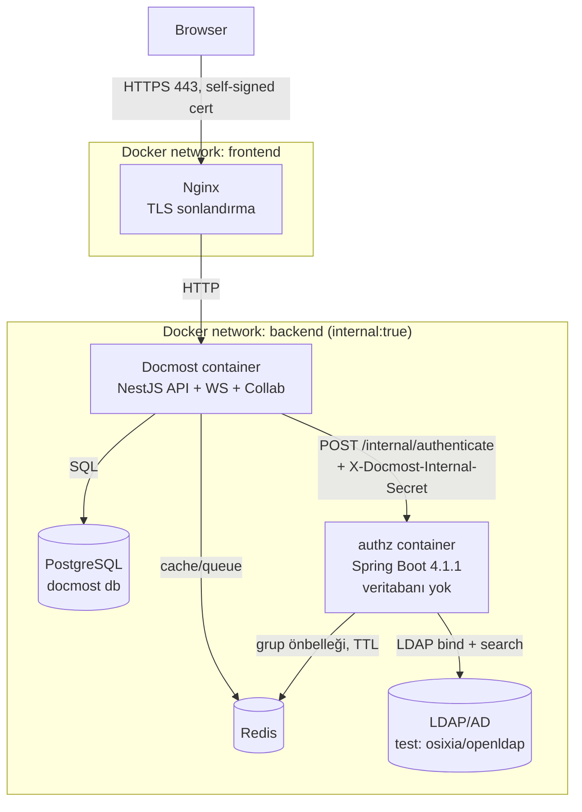
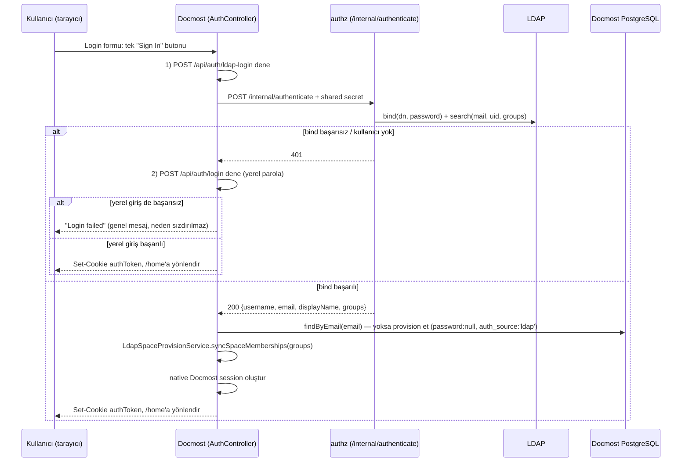

# Son Mimari ve Use Case'ler

> [02-requirements-1.md](./02-requirements-1.md)'deki gereksinimlerin **şu an çalışan, uygulanmış** halini anlatır. OSS temeli için → [01-docmost-oss-architecture.md](./01-docmost-oss-architecture.md). Test script'i için → [04-headless-browser-e2e-tests.md](./04-headless-browser-e2e-tests.md).

## 1. Özet

Docmost OSS fork'una iki parça eklendi:

1. **`authz/`** — bağımsız, **veritabanısız** bir Spring Boot 4.1.1 / Java 25 servisi. Tek işi: LDAP bind doğrulama + grup çözümleme (Redis önbellekli). Sayfa/kaynak bazlı bir yetkilendirme kararı **vermez**.
2. **Docmost sunucusunda (`apps/server`) hedefli değişiklikler**: `POST /api/auth/ldap-login` endpoint'i, `LdapAuthzService` HTTP istemcisi, LDAP kullanıcılarının parolasız provision edilmesi, ve LDAP grubuna göre otomatik space üyeliği.

Sayfa/space erişimi tamamen Docmost'un kendi native `SpaceRole`/`PagePermission` sistemine bırakılmıştır.

## 2. Bileşen ve Dağıtım Diyagramı

Dışarıya yalnızca Nginx'in 443 portu açıktır; Postgres, Redis, `authz` ve LDAP yalnızca `backend` (internal) ağındadır.

## 3. LDAP Giriş Akışı

Frontend tarafında bu sıralama tek bir `useAuth().signIn()` çağrısı içinde yürütülür (`handleCombinedSignIn` → önce `ldapLogin()`, hata alırsa `login()`).

## 4. LDAP Kullanıcı Provisioning ve Parola Politikası

- `SignupService.findOrProvisionFromLdap()`: LDAP'tan doğrulanan ama Docmost'ta kaydı olmayan kullanıcıyı `password: null, authSource: 'ldap'` ile oluşturur, mevcut workspace'e varsayılan `member` rolüyle ekler.
- `users.auth_source` (`'local' | 'ldap'`, varsayılan `'local'`) ve nullable `users.password` kolonları bu ayrımı tutar.
- `AuthService.login()` ve `AuthService.changePassword()`, `user.password` `NULL` ise `bcrypt.compare`'i hiç çağırmadan genel bir hatayla (`"Email or password does not match"` / `"Password change is not available for LDAP/SSO accounts"`) erken çıkar — null hash ile karşılaştırma denemesi bir sunucu hatasına yol açmaz.
- LDAP girişi ile yerel giriş **aynı** `sessionService.createSessionAndToken(user)` çağrısını kullanır; LDAP ile girilen bir oturum, sonraki tüm isteklerde yerel girişle birebir aynı davranır.
- `/settings/account/profile` sayfasında, Email alanının hemen üstünde bir **"Account type"** satırı gösterilir (`Local` / `LDAP`, `currentUser.user.authSource` alanından); `authSource` `ldap` ise "Password / Change password" bölümü hiç render edilmez (LDAP kullanıcısının zaten `NULL` bir Docmost parolası vardır, değiştirilecek bir şey yoktur).

## 5. LDAP Grubuna Göre Otomatik Space Üyeliği

- **Kural**: `INGWIKI_<AD>` adlı bir LDAP grubunun üyesi olan kullanıcı, LDAP ile her giriş yaptığında, aynı workspace içinde `INGWIKI-<AD>` adlı (case-insensitive) bir space varsa, oraya otomatik olarak `SpaceRole.WRITER` rolüyle eklenir. Örnek: LDAP grubu `INGWIKI_SPACE1` → space `INGWIKI-SPACE1`.
- **Idempotent, yalnızca ekleyici**: Zaten üye olan kullanıcı tekrar eklenmez (`SpaceMemberRepo.getUserSpaceRoles()` ile önce kontrol edilir — bu metot üye yoksa `undefined` döner, `[]` değil); kullanıcı LDAP grubundan çıkarılsa bile mevcut üyelik geri alınmaz.
- **Uygulama noktası**: `LdapSpaceProvisionService.syncSpaceMemberships()`, `AuthService.loginWithLdap()` içinden kullanıcı provision edildikten hemen sonra çağrılır; `SpaceMemberService.addUserToSpace()`'i kullanır. Başarısız olursa hata loglanır, login akışı bloklanmaz.
- **Bundan sonra**: Üyelik eklendikten sonra o space içindeki tüm işlemler tamamen Docmost'un kendi `SpaceRole` (`admin`/`writer`/`reader`) sistemi tarafından yönetilir — ayrı bir LDAP kontrolü yoktur.
- **Bilinen sınırlama**: Yalnızca grup adındaki `<AD>` kısmı ile space adındaki `<AD>` kısmı birebir (case-insensitive) eşleşirse çalışır; nested AD grupları çözülmez.

## 6. Login Formu Davranışı

- Tek `<form>`, tek "Sign In" butonu. Alan (`email`) yalnızca boş olmama kontrolünden geçer — e-posta formatı zorunlu değildir.
- `useAuth().signIn()` (`handleCombinedSignIn`): önce `ldapLogin({username, password})` dener; herhangi bir hatada (401/network/vb.) sessizce `login({email, password})`'e düşer (`attemptLocalSignIn`).
- Yerel giriş MFA gerektiriyorsa veya bulutta e-posta doğrulaması gerekiyorsa, bu özel yönlendirmeler korunur (başarı sayılır).
- İkisi de başarısız olursa kullanıcıya yalnızca `"Login failed"` gösterilir — hangi adımın (LDAP/yerel) neden başarısız olduğu (401 mi 400 mü) hiç sızdırılmaz; bu, hesabın LDAP'ta mı yerelde mi var olduğunu dışarıdan ayırt etmeyi zorlaştırır.

## 7. Use Case'ler

| Use Case | Aktör | Akış | İlgili FR |
|---|---|---|---|
| UC-1: LDAP ile giriş | Son kullanıcı | §3 | FR-1, FR-2, FR-3 |
| UC-2: LDAP kullanıcısının yerel girişi reddedilir | Son kullanıcı | §4 | FR-4, FR-5 |
| UC-3: Tek form, LDAP→yerel otomatik geçiş | Son kullanıcı | §6 | FR-7, FR-8, FR-9, FR-10 |
| UC-4: LDAP grubuna göre space'e otomatik katılım | Son kullanıcı | §5 | FR-12, FR-13, FR-14 |
| UC-5: LDAP/authz kullanılamıyor | Sistem | fail-closed, giriş reddedilir | FR-19 |

## 8. Bilinen Sınırlamalar

| # | Sınırlama | Not |
|---|---|---|
| L1 | Nested AD group resolution yok (yalnızca doğrudan `member`) | Gerekirse `LDAP_MATCHING_RULE_IN_CHAIN` ile genişletilebilir |
| L2 | `forgotPassword`/`passwordReset` akışları LDAP kullanıcıları için engellenmedi | Teorik olarak bir LDAP kullanıcısı parola sıfırlama akışından yerel bir parola edinebilir; takip işi |
| L3 | `DOCMOST-ADMIN` grubundaki bir kullanıcı Docmost'un native workspace-yönetim yetkilerini (üye davet, workspace ayarları) **otomatik almaz** | `role` alanı yalnızca `findOrProvisionFromLdap()`'a özel bir atama eklenerek genişletilebilir — yapılmadı |
| L4 | Public sharing (herkese açık link) LDAP modeliyle aynı güvenlik sınırında değildir | Workspace ayarlarından manuel kapatılmalı |

## 9. Otomatik Test Paketi (`authz`)

`authz` servisinin LDAP bind/grup çözümleme mantığı, gerçek bir LDAP/Docker ortamına ihtiyaç duymayan mock tabanlı **13 JUnit 5 testiyle** doğrulanır: `cd authz && mvn clean test`.

| Test sınıfı | Kapsam |
|---|---|
| `LdapServiceTest` (6 test) | Bind başarı/başarısızlık, bilinmeyen kullanıcı, dizin sorgu filtreleri |
| `LdapAuthenticationControllerTest` (3 test) | 401 eşlemesi, kullanıcı adı sızdırmama (`MockMvcBuilders.standaloneSetup`) |
| `InternalSecretFilterTest` (4 test) | Paylaşılan gizli anahtar kontrolü |

## 10. Operasyonel Notlar

- Repo kökü `/home/onder/dev/docmost/`; Docmost kaynağı haricindeki her şey (`authz/`, `nginx/`, `certs/`, `test/`, `spec/`, `docker-compose.yml`, `.env*`) `ingwiki/` alt klasöründedir. `docker-compose.yml`'in `docmost` servisi `context: ..` ile repo kökünü build eder.
- Ayağa kaldırma: `cd ingwiki && docker compose up -d`; `.env.example` → `.env` kopyalanıp secret'lar `openssl rand -hex 32` ile üretilmelidir.
- Test/geliştirme LDAP'ı: `ingwiki/test/ldap/` altında `osixia/openldap` + seed LDIF (`dc=placeholder,dc=test`), kullanıcılar `faruk/ali/ayse`, grup `INGWIKI_SPACE1` (üye: `ali`).
- Dışarıya yalnızca Nginx'in 443'ü (self-signed sertifika, `ingwiki` hostname'i) açılır.
- `authz` **veritabanı kullanmaz**; `/internal/authenticate` yalnızca `X-Docmost-Internal-Secret` header'ı ile erişilebilir.
- `authz` birim testleri: `cd ingwiki/authz && mvn clean test`.
- Uçtan uca canlı doğrulama script'i → [04-headless-browser-e2e-tests.md](./04-headless-browser-e2e-tests.md).

---
Doküman serisi: [01-docmost-oss-architecture.md](./01-docmost-oss-architecture.md) → [02-requirements-1.md](./02-requirements-1.md) → 03 (bu doküman) → [04-headless-browser-e2e-tests.md](./04-headless-browser-e2e-tests.md).
